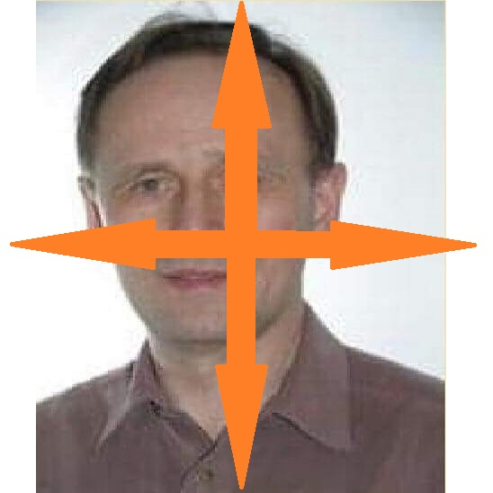
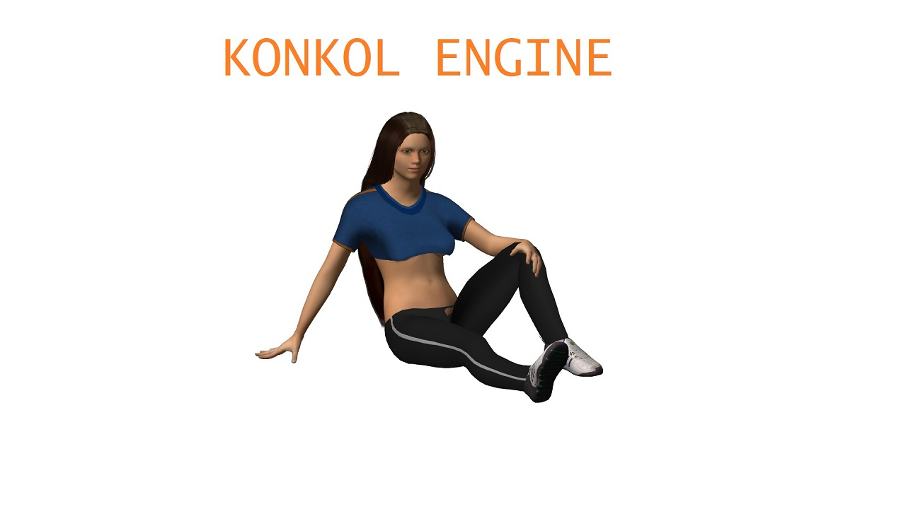

# Konkol Engine

* Features (WIP)
    * Universal SCN loader
    * MMD loader
    * Universal file parser
    * MMD loader
* Graphics features(WIP)
	* Runtime shader compiler
	* NVIDIA Rary Tracing libraries 
	* HDRP 
* Simulation libraries(WIP)
	*Nvidia Physx
	*Siadura Physics - Realtime ralistic physics simulation library
	
* Dependencies(WIP)
	* SDL - Simple Direct Media Layer
	* OpenGL 3.0
	* GLM
	

## Environment

* Windows
  * Visual Studio 2019
  
* Linux: not supported at this momment
